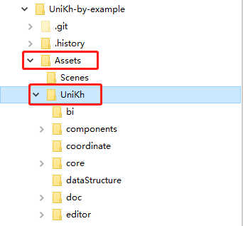

# Install UniKh by source code

使用原码方式安装 UniKh 到你的 Unity 项目 

### Step 1

Select the desired version on the project page of [bagaking/UniKh](https://github.com/bagaking/UniKh). If you don't know which one to choose or want to use the latest version, skip this step.

在 [bagaking/UniKh](https://github.com/bagaking/UniKh) 的项目页面上选择所需要的版本, 如果不知道如何选择或者想使用最新的版本, 可以跳过这一步.

### Step 2

Download the code package in Zip mode.

下载Zip压缩的代码包.

and extract it to the `/Assets/UniKh` directory of your Unity project.

并将其解压到 Unity 项目的 `/Assets/UniKh` 目录下.

### Step3

If the installation is succeeded, start your Unity project and then you will see the UniKh menu.

启动 Unity, 看到 UniKh 菜单即说明安装成功.

